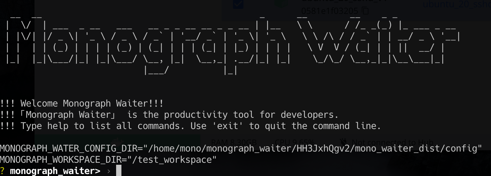

# MonographDB Waiter



## Introduction

Monograph Waiter is productivity tools for developers. Enables developers to more easily build, debug, and run
MonographDB, both single node and distributed.

> NOTE: Currently only fully tested on Ubuntu and sudo user privilege is required to run ``monograph_waiter``.

## Build

- If you do not have Rust installed, please follow the command below to install it.

> NOTE: For Ubuntu, you need to install pkg-config and libssl-dev. run sudo apt install pkg-config libssl-dev

```shell
curl --proto '=https' --tlsv1.2 -sSf https://sh.rustup.rs | sh
```

- Install cargo make

```shell
cargo install --force cargo-make
```

- Compile and generate release files

```shell
cargo make --makefile cargo-make.toml all-flow
```

- Run

```shell
cd mono_waiter_dist
./monograph_waiter --config $PWD/config
```

## Features

1. management compile and run dependencies
2. playground
3. autocomplete and command history support

## How to use

For a more detailed description of the command, please read the [command doc](./doc/command.md)

- If you have never compiled and run MonographDB before, please follow these steps to create a workspace.

```text
 monograph_waiter> install_deps
 monograph_waiter> setup_workspace
 monograph_waiter> ln_source
 monograph_waiter> build_all
 monograph_waiter> gen_mysql_cnf
 monograph_waiter> init_db
```

- If you have already compiled and run MonographDB, execute the following command.

```text
 monograph_waiter> setup_workspace
 monograph_waiter> ln_source
 monograph_waiter> build_all
 monograph_waiter> gen_mysql_cnf
 monograph_waiter> init_db 
```